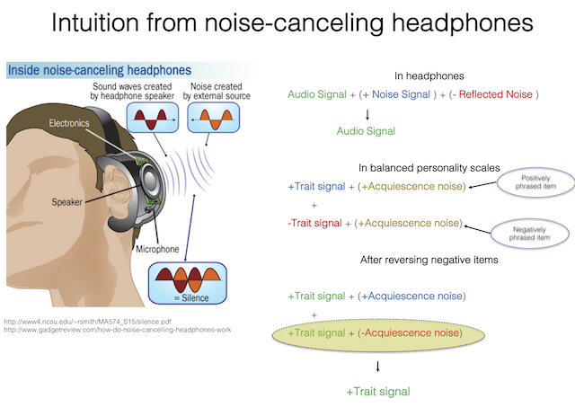

#### Modeling Acquiescence with Multidimensional Item Response Theory (MIRT)  

This is a repository of code, data and additional materials of papers dealing with Acquiescence using modern methods of MIRT with random intercept:

* Primi, R., Santos, D., De Fruyt, F., & John, O. P. (2018). Acquiescence and Person Differential Functioning: Solving Person DIF with Balanced Scales. https://doi.org/10.31219/osf.io/zsrwt  

* Primi, R., De Fruyt, F., Santos, D., Antonoplis, S. & John, O. P. (2018). True or False? Keying Direction and Acquiescence Influence the Validity of Socio-Emotional Skills Items in Predicting High School Achievement. Submitted paper under review  

* Primi, R., Hauck-Filho, N., Valentini, F., Validity, Santos, D. & Falk, C. F. (2918) Controlling Acquiescence Bias with Multidimensional IRT Modeling.  Submitted Chapter  under review  

* Primi, R. & Santos, D. (2018). Classical psychometric methods of acquiescence control with balanced scales. http://www.labape.com.br/acqu_mirt/methods_of_recoding.html   

* Simulation developed in the paper
http://www.labape.com.br/acqu_mirt/simulation.html  
  

    
Acquiescence bias in balanced scales correction functions similar to noise canceling headphones  

