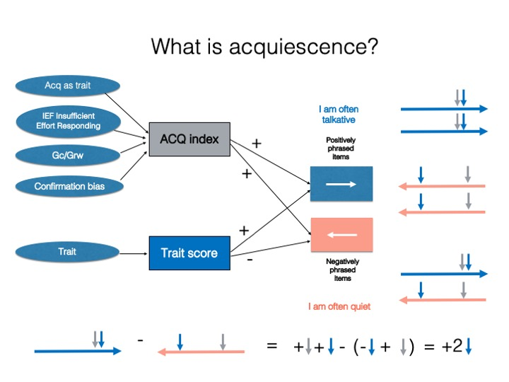

##### Modeling Acquiescence with Multidimensional Item Response Theory (MIRT)  

This is a repository of code, data and additional materials of papers dealing with acquiescence using modern methods of MIRT with random intercept:

* Primi, R. , Santos, D. , De Fruyt, F. and John, O. P. (2019), Comparison of classical and modern methods for measuring and correcting for acquiescence. _Br J Math Stat Psychol_. doi:10.1111/bmsp.12168  
    + An earlier version of this paper was posted as a pre-print OSF:  Primi, R., Santos, D., De Fruyt, F., & John, O. P. (2018). Acquiescence and Person Differential Functioning: Solving Person DIF with Balanced Scales. https://doi.org/10.31219/osf.io/zsrwt  

* Primi, R., De Fruyt, F., Santos, D., Antonoplis, S. & John, O. P. (in-press). True or False? Keying Direction and Acquiescence Influence the Validity of Socio-Emotional Skills Items in Predicting High School Achievement. _International Journal of Testing_ 

* Primi, R., Hauck-Filho, N., Valentini, F., Validity, Santos, D. & Falk, C. F. (2019) Controlling Acquiescence Bias with Multidimensional IRT Modeling. in Wiberg, S. Culpepper, R. Janssen, J. González, & D. Molenaar (Eds.), _Quantitative Psychology, Springer Proceedings in Mathematics & Statistics_ 265, (pp. 39-52),Springer International Publishing, https://doi.org/10.1007/978-3-030-01310-3_4

* Primi, R. & Santos, D. (2018). Classical psychometric methods of acquiescence control with balanced scales. http://www.labape.com.br/acqu_mirt/methods_of_recoding.html   

* Code for the simulations presented in the paper "Comparison of classical and modern methods  .."
http://www.labape.com.br/acqu_mirt/simulation.html  
  

    
Acquiescence bias in balanced scales correction functions similar to noise canceling headphones  

  
  